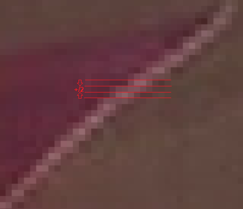

* Vxx official Acorn release
* Dxx Russian bootleg, Russian audio instead of French, video is the same

Season 3 episodes are mostly "progressive", the second field is just a fake interpolated image of the first field. One way to deal with this is to throw away the second field and upscale it with a better algorithm again. The problem is, the second field is still missing, diagonal lines will never really look diagonal, as scalers only operate in horizonal or vertical direction. Update: eedi3 does a good job restoring those lines.

There are a few 59.94i scenes, where small features, like stars, are on alternating fields, a single field deinterlacer would mean losing a lot of detail and shimmering. There are also the usual hybrid scenes, 4 + 1 dup and 5 real frames layered on top of each other. These are harder to fix, as there are no redundant fields to choose from.

