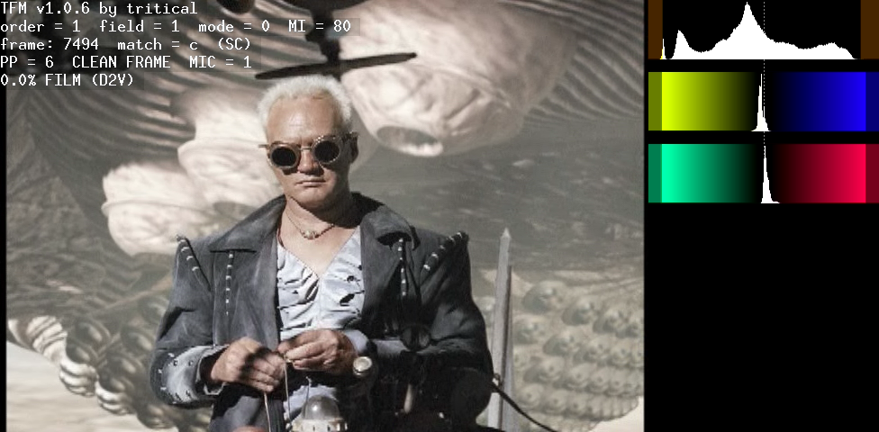
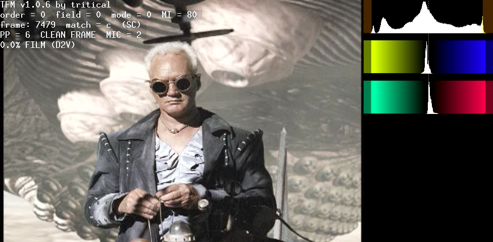
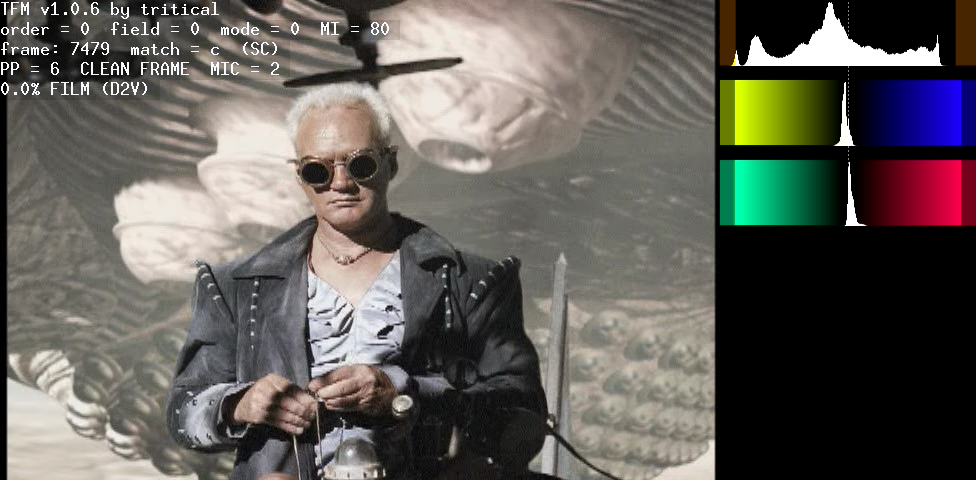

S03 Alliance release has a higher bitrate than Acorn, but they increased the brightness and clamped about 10% of the top values to the TV level (16-235). It is not possible to restore the image detail in that range, it will either look too bright or flat. Not all episodes have this problem fortunatelly.

