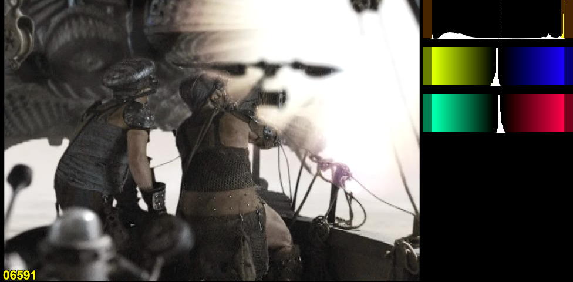
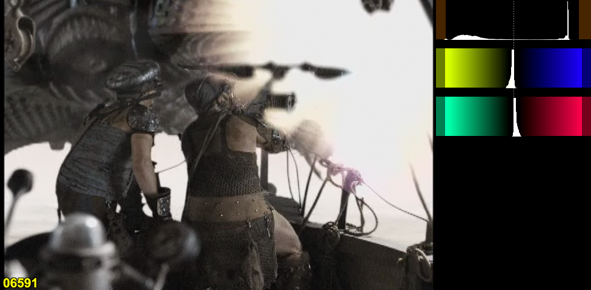
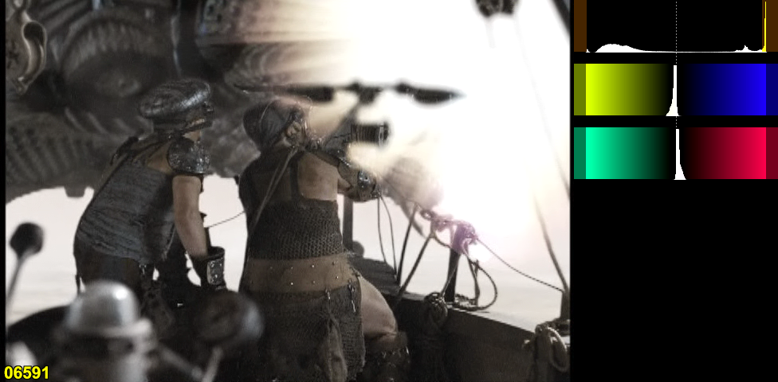
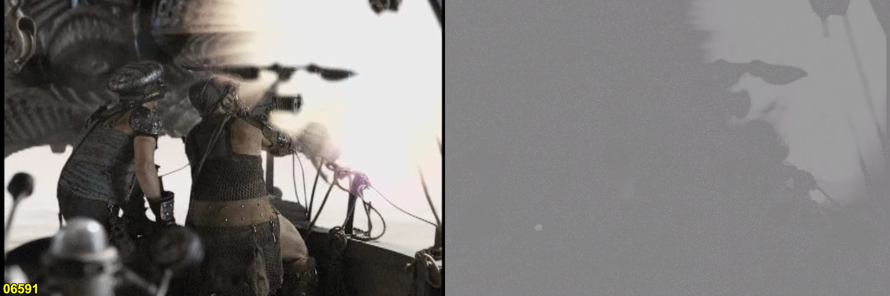

S03 Alliance release has a higher bitrate than Acorn, but they increased the brightness and clamped about 10% of the high values to the TV level (16-235). It is not possible to restore the image detail in that range, it will either look too bright or flat. Not all episodes have this problem fortunatelly, only the first three.

Avisynth script to correct the levels:

    # better match with the original
    ConvertBits(16).Levels(396, 1, 65280, 0, 60416, coring=false).ConvertBits(8, dither=1)

    # better fill of the whole luma range
    ConvertBits(16).Levels(396, 1, 65280, 0, 63488, coring=false).ConvertBits(8, dither=1)

### Acorn

### Alliance

### Allince after levels correction

### Allince + clipped values from Acorn

### Difference

